<!-- ===================== ANIMATED HEADER ===================== -->
<div align="center">


<a href="https://github.com/ashrithBalaji456/Code_PlayGround">
  
</a>

<br/>


<br/>

[**Features**](#-key-features) •
[**How It Works**](#-how-it-works) •
[**Workflows**](#-workflow-charts) •
[**Data Charts**](#-data-charts--analytics) •
[**Quick Start**](#-quick-start) •
[**Shortcuts**](#%EF%B8%8F-keyboard-shortcuts) •
[**Roadmap**](#-roadmap)

</div>

---

## 📖 About

**CodeFlow DSA Lab** is an interactive programming learning platform where you write and execute **real Java or Python code** and watch the **actual execution** drawn visually, live, in memory.

> ⚠️ It is **not** a collection of hardcoded algorithm animations. Every visual comes from what *your* code really does.

The core principle behind the entire project:

$$\text{USER CODE} \longrightarrow \text{ACTUAL EXECUTION} \longrightarrow \text{EXECUTION EVENTS} \longrightarrow \text{STATE CHANGES} \longrightarrow \text{LIVE ANIMATION}$$

Whenever your code **creates, modifies, accesses, moves, compares, links, removes, or returns** data, the matching visualization updates automatically, in sync with source-code line highlighting.

<div align="center">


```mermaid
flowchart LR
    A["👨‍💻 User Code"] ==> B["⚙️ Actual Execution"]
    B ==> C["📡 Execution Events"]
    C ==> D["🧠 State Changes"]
    D ==> E["🎬 Live Animation"]
    style A fill:#0ea5e9,stroke:#0369a1,color:#fff
    style B fill:#6366f1,stroke:#4338ca,color:#fff
    style C fill:#8b5cf6,stroke:#6d28d9,color:#fff
    style D fill:#a855f7,stroke:#7e22ce,color:#fff
    style E fill:#ec4899,stroke:#be185d,color:#fff
```

</div>

---

## 🌟 Key Features

<table>
<tr>
<td width="50%" valign="top">

### 🧩 Normalized Event Model
One generic event schema that unifies Java and Python runtimes:

`ARRAY_CREATE` · `ARRAY_UPDATE` · `ARRAY_SWAP` · `STACK_PUSH` · `STACK_POP` · `QUEUE_ENQUEUE` · `QUEUE_DEQUEUE` · `NODE_CREATE` · `NODE_LINK` · `TREE_LINK` · `MAP_INSERT` · `CONDITION_EVALUATE` · `FUNCTION_CALL` · `FUNCTION_RETURN` · `EXCEPTION`

</td>
<td width="50%" valign="top">

### 🖼️ Dynamic Multi-Structure Canvas
Every active variable gets its **own** visualization automatically.

```java
Stack<Integer> a = new Stack<>();
Stack<Integer> b = new Stack<>();
Stack<Integer> c = new Stack<>();
```
➡️ Three independent stacks, side by side.

</td>
</tr>
<tr>
<td width="50%" valign="top">

### 🐞 Rich Debugger Panels
- **Variables**: scope, type, value, reference, memory estimate
- **Stack vs Heap** model with byte estimates
- **Call Stack** with recursion descent and return values
- **Console** for `System.out.println` / `print`
- **Visual exceptions** for `NullPointerException` and `ArrayIndexOutOfBoundsException`

</td>
<td width="50%" valign="top">

### 🎛️ Integrated IDE and Controls
- Monaco Editor with Java and Python highlighting
- Gutter **breakpoints**
- **Run · Pause · Resume · Stop · Restart**
- **Prev / Next Step**, **Step Over / Into / Out**
- **Timeline scrubber** and **0.25× → 4×** speed
- Built-in **Study Guide** with Big-O analysis and exercises

</td>
</tr>
</table>

### 🧱 Supported Data Structures

| Structure | What You See |
|:--|:--|
| 🔢 **Arrays & 2D Matrices** | In-place mutations, live pointers (`i`, `j`, `left`, `right`), toggleable **Chart Tracer** bar-height view |
| 📚 **Stacks** | Vertical vessel, `top` pointer, LIFO push/pop animation |
| 🚋 **Queues** | FIFO conveyor pipeline with `front` (dequeue) and `rear` (enqueue) indicators |
| 🔗 **Linked Lists** | Heap nodes `[ Value │ Next • ]`, animated SVG arrows, `head` / `curr` / `prev` tags, null terminator |
| 🌳 **Trees & Heaps** | Parent-child SVG branches, plus level-order array mapping for heaps |
| 🗂️ **Hash Tables** | `Key ➔ hash() ➔ % Capacity ➔ Bucket Slot ➔ Chained Entry` |
| 🕸️ **Graphs** | Interactive SVG graph with circular vertices and directed edges |

---

## 🔍 How It Works

### 🏗️ System Architecture

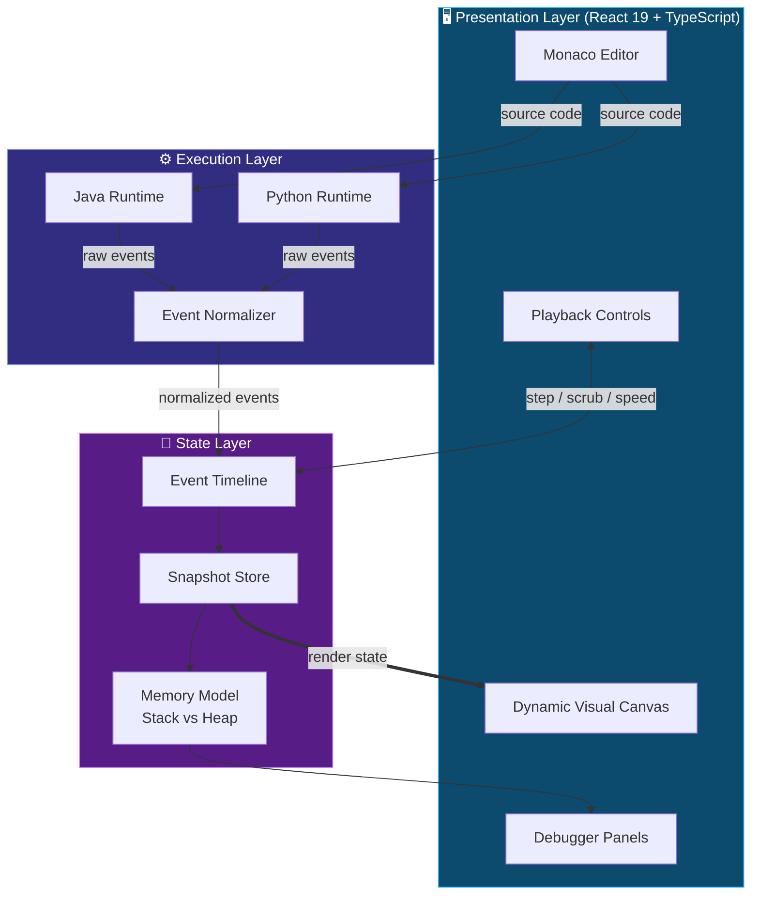
```mermaid
flowchart TB
    subgraph UI["🖥️ Presentation Layer  (React 19 + TypeScript)"]
        direction LR
        ED["Monaco Editor"]
        CV["Dynamic Visual Canvas"]
        DB["Debugger Panels"]
        CT["Playback Controls"]
    end

    subgraph CORE["⚙️ Execution Layer"]
        direction LR
        JR["Java Runtime"]
        PR["Python Runtime"]
        NM["Event Normalizer"]
    end

    subgraph STATE["🧠 State Layer"]
        direction LR
        EV["Event Timeline"]
        SS["Snapshot Store"]
        MM["Memory Model\nStack vs Heap"]
    end

    ED -->|"source code"| JR
    ED -->|"source code"| PR
    JR -->|"raw events"| NM
    PR -->|"raw events"| NM
    NM -->|"normalized events"| EV
    EV --> SS
    SS --> MM
    SS ==>|"render state"| CV
    MM --> DB
    CT <-->|"step / scrub / speed"| EV

    style UI fill:#0c4a6e,stroke:#38bdf8,color:#fff
    style CORE fill:#312e81,stroke:#818cf8,color:#fff
    style STATE fill:#581c87,stroke:#c084fc,color:#fff
```

### 🔄 Execution Sequence

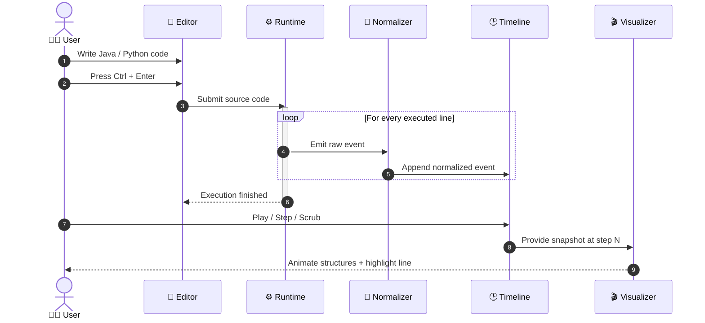
```mermaid
sequenceDiagram
    autonumber
    actor U as 👨‍💻 User
    participant E as 📝 Editor
    participant R as ⚙️ Runtime
    participant N as 🔀 Normalizer
    participant T as 🕒 Timeline
    participant V as 🎬 Visualizer

    U->>E: Write Java / Python code
    U->>E: Press Ctrl + Enter
    E->>R: Submit source code
    activate R
    loop For every executed line
        R->>N: Emit raw event
        N->>T: Append normalized event
    end
    R-->>E: Execution finished
    deactivate R
    U->>T: Play / Step / Scrub
    T->>V: Provide snapshot at step N
    V-->>U: Animate structures + highlight line
```

---

## 🔁 Workflow Charts

### 1️⃣ End-to-End User Workflow

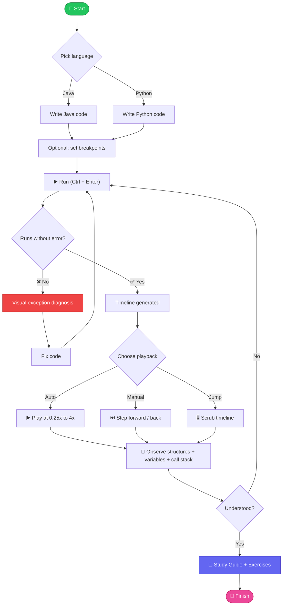
```mermaid
flowchart TD
    S(["🚀 Start"]) --> L{"Pick language"}
    L -->|"Java"| J["Write Java code"]
    L -->|"Python"| P["Write Python code"]
    J --> BP["Optional: set breakpoints"]
    P --> BP
    BP --> RUN["▶️ Run  (Ctrl + Enter)"]
    RUN --> OK{"Runs without error?"}
    OK -->|"❌ No"| EXC["Visual exception diagnosis"]
    EXC --> FIX["Fix code"] --> RUN
    OK -->|"✅ Yes"| PLAY["Timeline generated"]
    PLAY --> CTRL{"Choose playback"}
    CTRL -->|"Auto"| AUTO["▶️ Play at 0.25x to 4x"]
    CTRL -->|"Manual"| STEP["⏭️ Step forward / back"]
    CTRL -->|"Jump"| SCR["🎚️ Scrub timeline"]
    AUTO --> OBS["👀 Observe structures + variables + call stack"]
    STEP --> OBS
    SCR --> OBS
    OBS --> DONE{"Understood?"}
    DONE -->|"No"| RUN
    DONE -->|"Yes"| STUDY["📘 Study Guide + Exercises"]
    STUDY --> E(["🎉 Finish"])

    style S fill:#22c55e,stroke:#15803d,color:#fff
    style E fill:#ec4899,stroke:#be185d,color:#fff
    style EXC fill:#ef4444,stroke:#b91c1c,color:#fff
    style STUDY fill:#6366f1,stroke:#4338ca,color:#fff
```

### 2️⃣ Event Processing Pipeline

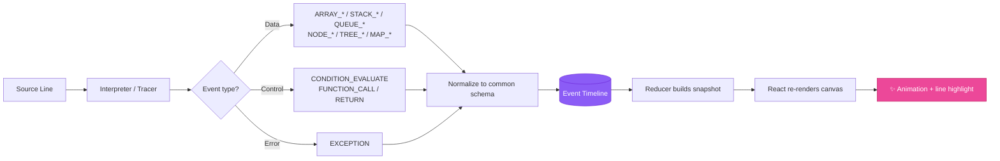
```mermaid
flowchart LR
    A["Source Line"] --> B["Interpreter / Tracer"]
    B --> C{"Event type?"}
    C -->|"Data"| D["ARRAY_* / STACK_* / QUEUE_*\nNODE_* / TREE_* / MAP_*"]
    C -->|"Control"| E["CONDITION_EVALUATE\nFUNCTION_CALL / RETURN"]
    C -->|"Error"| F["EXCEPTION"]
    D --> G["Normalize to common schema"]
    E --> G
    F --> G
    G --> H[("Event Timeline")]
    H --> I["Reducer builds snapshot"]
    I --> J["React re-renders canvas"]
    J --> K["✨ Animation + line highlight"]

    style H fill:#8b5cf6,stroke:#6d28d9,color:#fff
    style K fill:#ec4899,stroke:#be185d,color:#fff
```

### 3️⃣ Playback State Machine

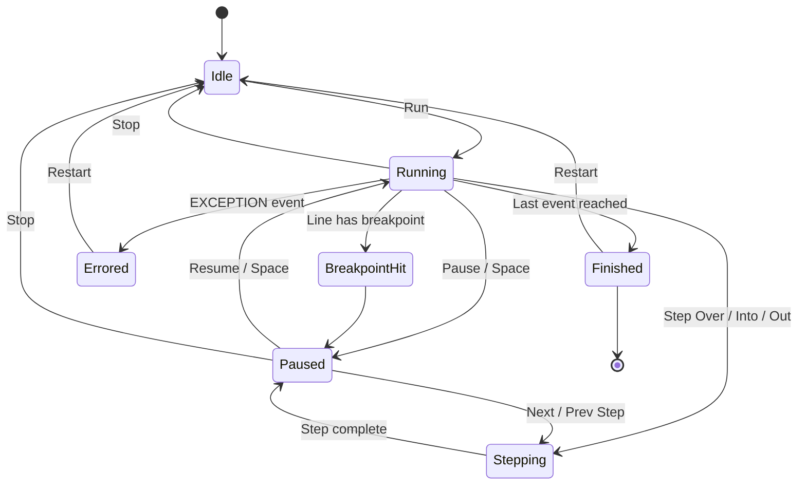
```mermaid
stateDiagram-v2
    [*] --> Idle
    Idle --> Running: Run
    Running --> Paused: Pause / Space
    Paused --> Running: Resume / Space
    Running --> Stepping: Step Over / Into / Out
    Paused --> Stepping: Next / Prev Step
    Stepping --> Paused: Step complete
    Running --> BreakpointHit: Line has breakpoint
    BreakpointHit --> Paused
    Running --> Errored: EXCEPTION event
    Running --> Finished: Last event reached
    Errored --> Idle: Restart
    Finished --> Idle: Restart
    Paused --> Idle: Stop
    Running --> Idle: Stop
    Finished --> [*]
```

### 4️⃣ Hash Table Insert Flow

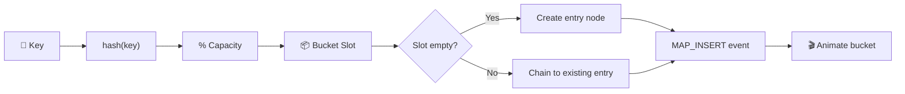
```mermaid
flowchart LR
    K["🔑 Key"] --> H["hash(key)"]
    H --> M["% Capacity"]
    M --> B["📦 Bucket Slot"]
    B --> C{"Slot empty?"}
    C -->|"Yes"| N1["Create entry node"]
    C -->|"No"| N2["Chain to existing entry"]
    N1 --> O["MAP_INSERT event"]
    N2 --> O
    O --> V["🎬 Animate bucket"]
```

### 5️⃣ Recursion and Call Stack Flow

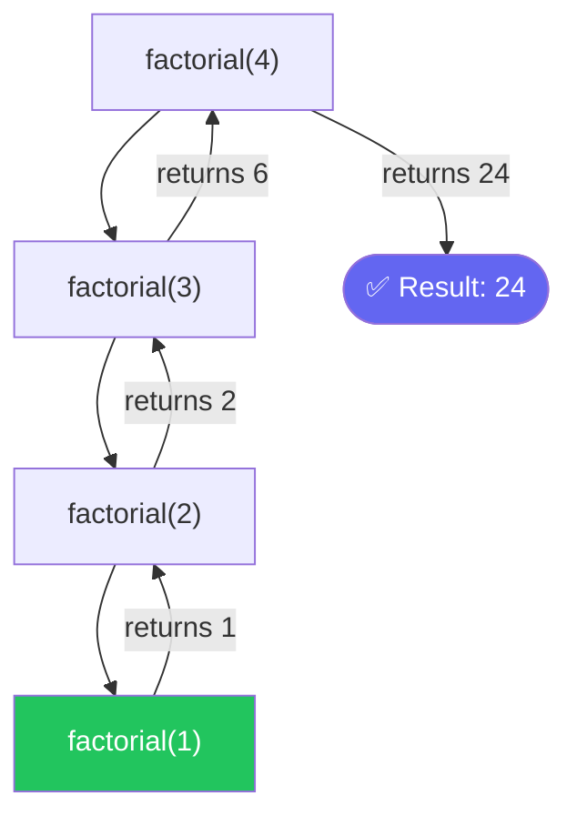
```mermaid
flowchart TD
    A["factorial(4)"] --> B["factorial(3)"]
    B --> C["factorial(2)"]
    C --> D["factorial(1)"]
    D -->|"returns 1"| C
    C -->|"returns 2"| B
    B -->|"returns 6"| A
    A -->|"returns 24"| R(["✅ Result: 24"])
    style D fill:#22c55e,color:#fff
    style R fill:#6366f1,color:#fff
```

### 6️⃣ Exception Diagnostics Flow

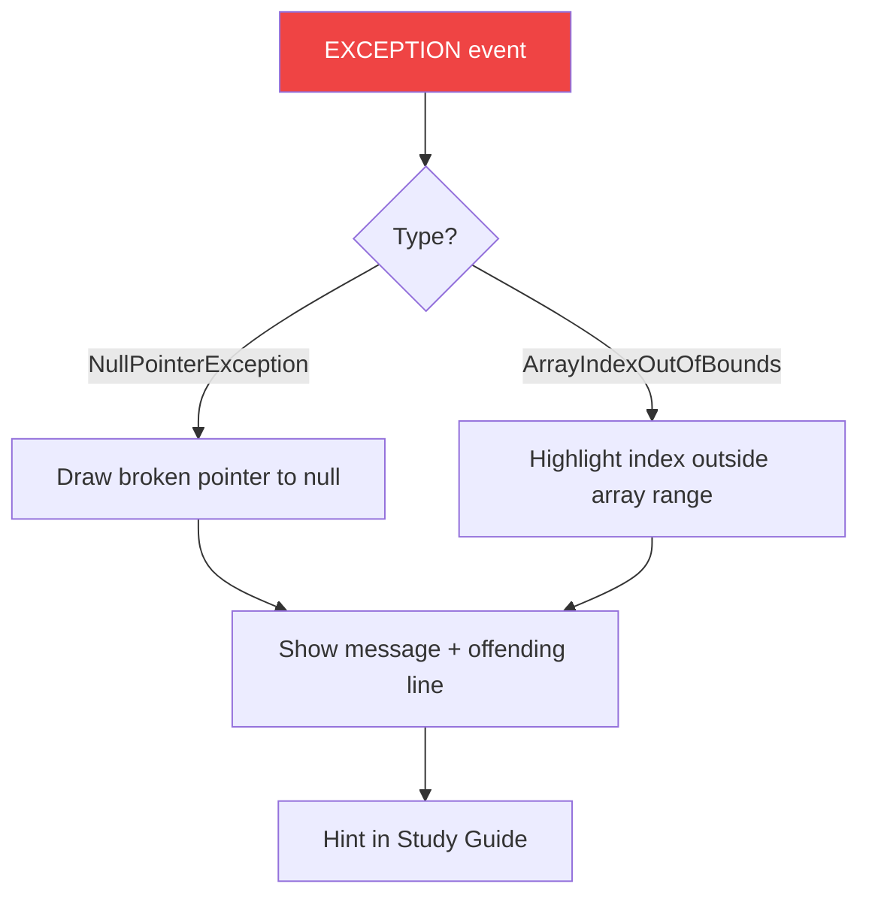
```mermaid
flowchart TD
    X["EXCEPTION event"] --> T{"Type?"}
    T -->|"NullPointerException"| N["Draw broken pointer to null"]
    T -->|"ArrayIndexOutOfBounds"| A["Highlight index outside array range"]
    N --> M["Show message + offending line"]
    A --> M
    M --> H["Hint in Study Guide"]
    style X fill:#ef4444,color:#fff
```

### 7️⃣ Contribution Workflow (Git)

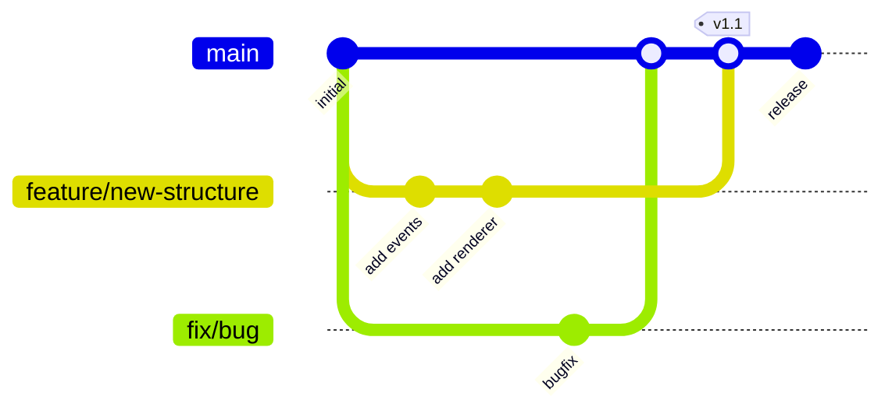
```mermaid
gitGraph
    commit id: "initial"
    branch feature/new-structure
    checkout feature/new-structure
    commit id: "add events"
    commit id: "add renderer"
    checkout main
    branch fix/bug
    commit id: "bugfix"
    checkout main
    merge fix/bug
    merge feature/new-structure tag: "v1.1"
    commit id: "release"
```

---

## 📊 Data Charts & Analytics

> 📝 **Note:** the charts below are **illustrative project overviews** (feature coverage, effort, roadmap). Adjust the numbers to match your real project data.

### 🥧 Feature Distribution

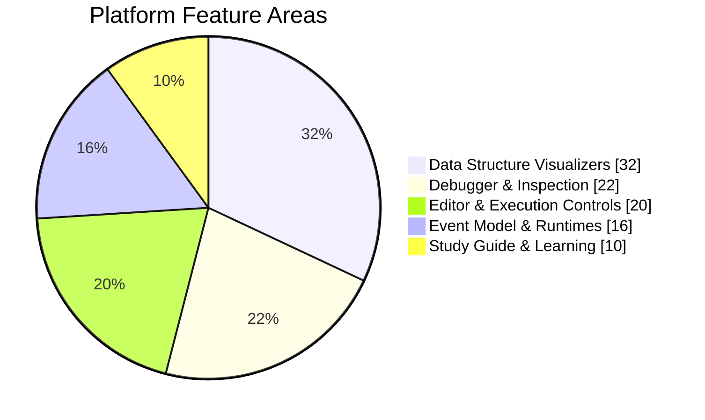
```mermaid
pie showData
    title Platform Feature Areas
    "Data Structure Visualizers" : 32
    "Debugger & Inspection" : 22
    "Editor & Execution Controls" : 20
    "Event Model & Runtimes" : 16
    "Study Guide & Learning" : 10
```

### 📈 Supported Structures: Visual Complexity Score

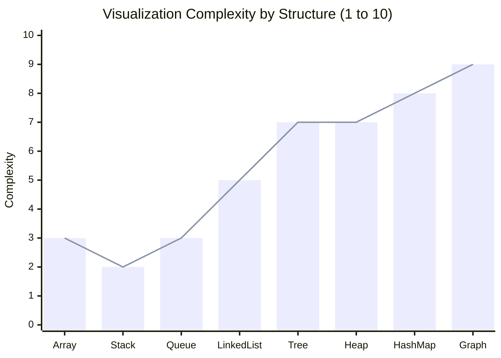
```mermaid
xychart-beta
    title "Visualization Complexity by Structure (1 to 10)"
    x-axis ["Array", "Stack", "Queue", "LinkedList", "Tree", "Heap", "HashMap", "Graph"]
    y-axis "Complexity" 0 --> 10
    bar [3, 2, 3, 5, 7, 7, 8, 9]
    line [3, 2, 3, 5, 7, 7, 8, 9]
```

### 🚀 Playback Speed Options

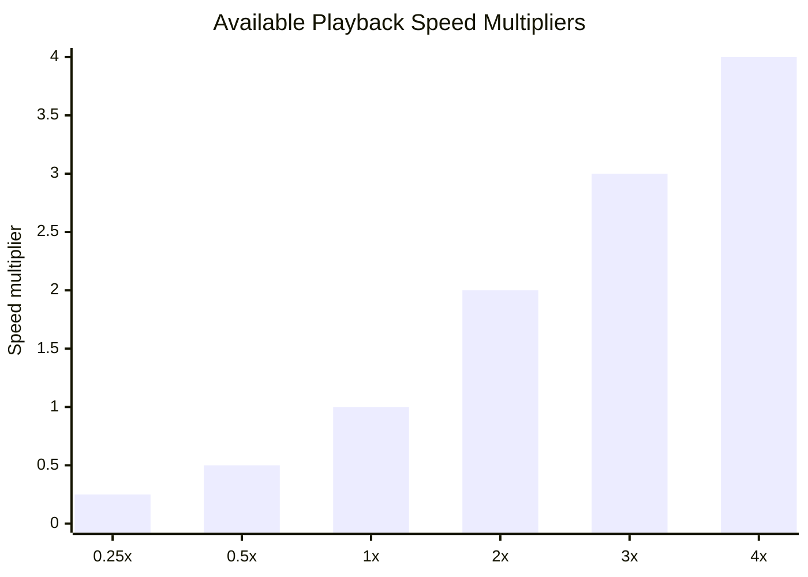
```mermaid
xychart-beta
    title "Available Playback Speed Multipliers"
    x-axis ["0.25x", "0.5x", "1x", "2x", "3x", "4x"]
    y-axis "Speed multiplier" 0 --> 4
    bar [0.25, 0.5, 1, 2, 3, 4]
```

### 🗓️ Development Roadmap (Gantt)

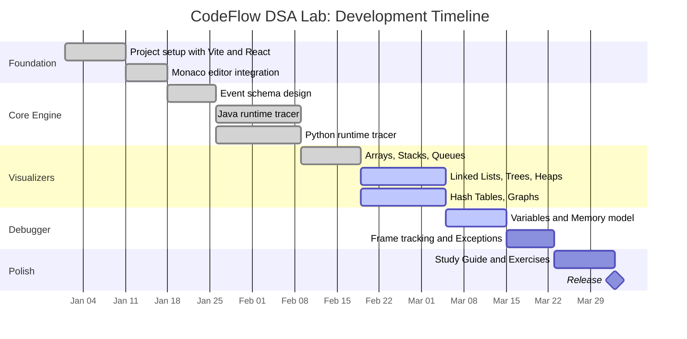
```mermaid
gantt
    title CodeFlow DSA Lab: Development Timeline
    dateFormat  YYYY-MM-DD
    axisFormat  %b %d
    section Foundation
    Project setup with Vite and React   :done,    a1, 2026-01-01, 10d
    Monaco editor integration           :done,    a2, after a1, 7d
    section Core Engine
    Event schema design                 :done,    b1, after a2, 8d
    Java runtime tracer                 :done,    b2, after b1, 14d
    Python runtime tracer               :done,    b3, after b1, 14d
    section Visualizers
    Arrays, Stacks, Queues              :done,    c1, after b2, 10d
    Linked Lists, Trees, Heaps          :active,  c2, after c1, 14d
    Hash Tables, Graphs                 :active,  c3, after c1, 14d
    section Debugger
    Variables and Memory model          :active,  d1, after c2, 10d
    Frame tracking and Exceptions       :         d2, after d1, 8d
    section Polish
    Study Guide and Exercises           :         e1, after d2, 10d
    Release                             :milestone, e2, after e1, 0d
```

### 🌐 Data Flow Volume (Sankey)

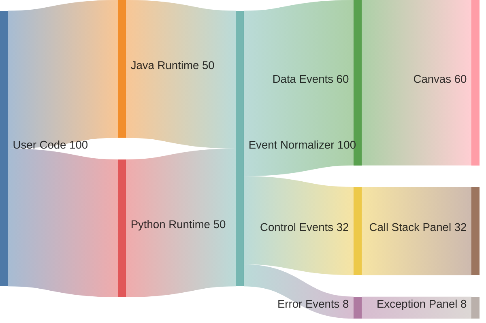
```mermaid
sankey-beta

User Code,Java Runtime,50
User Code,Python Runtime,50
Java Runtime,Event Normalizer,50
Python Runtime,Event Normalizer,50
Event Normalizer,Data Events,60
Event Normalizer,Control Events,32
Event Normalizer,Error Events,8
Data Events,Canvas,60
Control Events,Call Stack Panel,32
Error Events,Exception Panel,8
```

### 🎯 Priority Matrix (Quadrant)

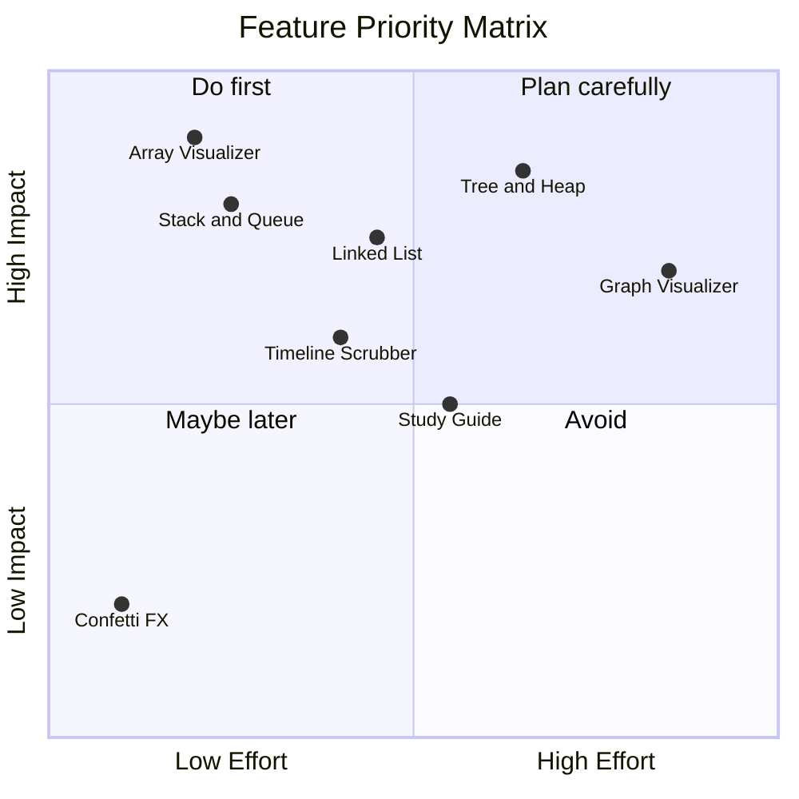
```mermaid
quadrantChart
    title Feature Priority Matrix
    x-axis Low Effort --> High Effort
    y-axis Low Impact --> High Impact
    quadrant-1 Plan carefully
    quadrant-2 Do first
    quadrant-3 Maybe later
    quadrant-4 Avoid
    Array Visualizer: [0.2, 0.9]
    Stack and Queue: [0.25, 0.8]
    Linked List: [0.45, 0.75]
    Tree and Heap: [0.65, 0.85]
    Graph Visualizer: [0.85, 0.7]
    Timeline Scrubber: [0.4, 0.6]
    Confetti FX: [0.1, 0.2]
    Study Guide: [0.55, 0.5]
```

### 👤 Learner Journey

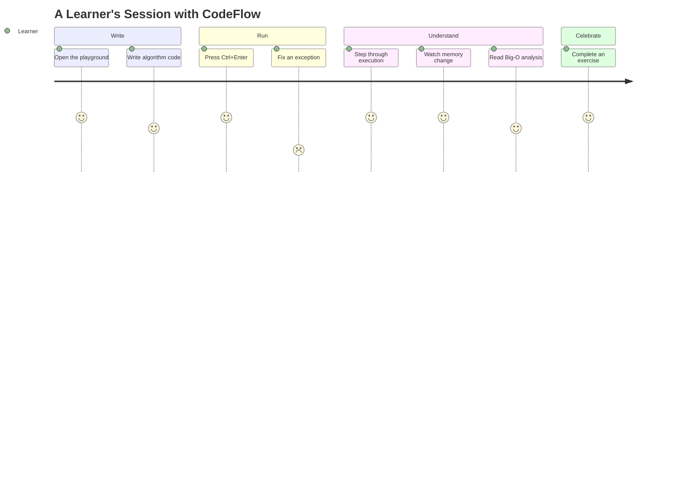
```mermaid
journey
    title A Learner's Session with CodeFlow
    section Write
      Open the playground: 5: Learner
      Write algorithm code: 4: Learner
    section Run
      Press Ctrl+Enter: 5: Learner
      Fix an exception: 2: Learner
    section Understand
      Step through execution: 5: Learner
      Watch memory change: 5: Learner
      Read Big-O analysis: 4: Learner
    section Celebrate
      Complete an exercise: 5: Learner
```

### 🧠 Feature Mind Map

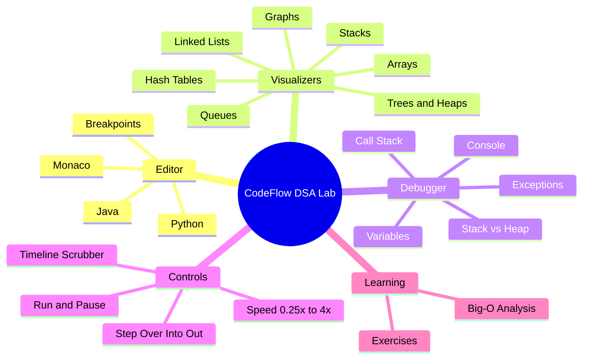
```mermaid
mindmap
  root((CodeFlow DSA Lab))
    Editor
      Monaco
      Java
      Python
      Breakpoints
    Visualizers
      Arrays
      Stacks
      Queues
      Linked Lists
      Trees and Heaps
      Hash Tables
      Graphs
    Debugger
      Variables
      Stack vs Heap
      Call Stack
      Console
      Exceptions
    Controls
      Run and Pause
      Step Over Into Out
      Timeline Scrubber
      Speed 0.25x to 4x
    Learning
      Big-O Analysis
      Exercises
```

### 🕒 Project Timeline

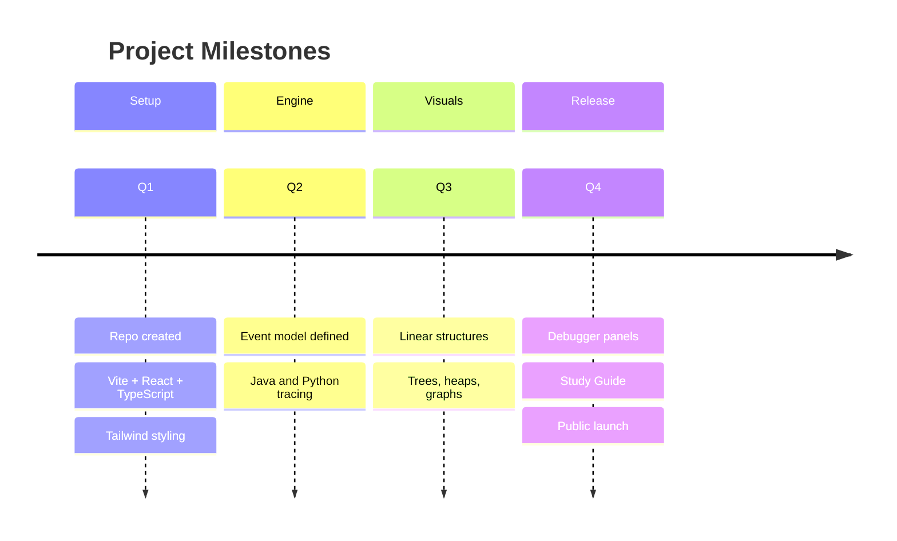
```mermaid
timeline
    title Project Milestones
    section Setup
        Q1 : Repo created
           : Vite + React + TypeScript
           : Tailwind styling
    section Engine
        Q2 : Event model defined
           : Java and Python tracing
    section Visuals
        Q3 : Linear structures
           : Trees, heaps, graphs
    section Release
        Q4 : Debugger panels
           : Study Guide
           : Public launch
```

### 🗃️ Core Data Model (ER Diagram)

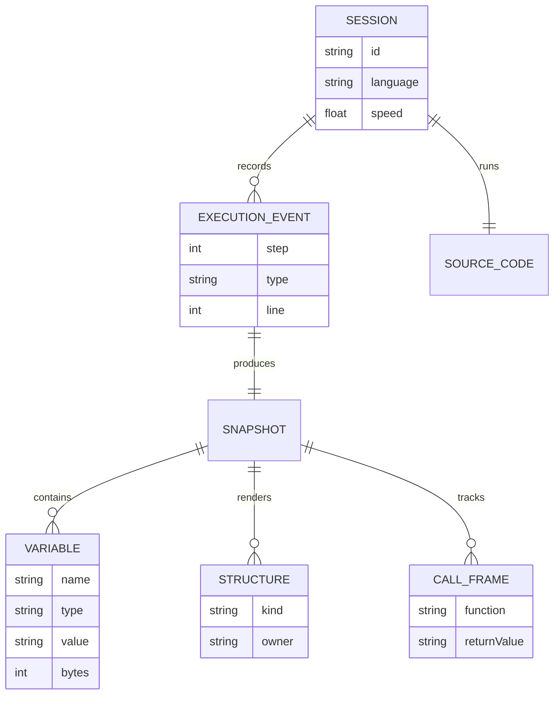
```mermaid
erDiagram
    SESSION ||--o{ EXECUTION_EVENT : records
    SESSION ||--|| SOURCE_CODE : runs
    EXECUTION_EVENT ||--|| SNAPSHOT : produces
    SNAPSHOT ||--o{ VARIABLE : contains
    SNAPSHOT ||--o{ STRUCTURE : renders
    SNAPSHOT ||--o{ CALL_FRAME : tracks

    SESSION {
        string id
        string language
        float speed
    }
    EXECUTION_EVENT {
        int step
        string type
        int line
    }
    VARIABLE {
        string name
        string type
        string value
        int bytes
    }
    STRUCTURE {
        string kind
        string owner
    }
    CALL_FRAME {
        string function
        string returnValue
    }
```

### 🧬 Event Class Model

```mermaid
classDiagram
    class ExecutionEvent {
        +int step
        +int line
        +EventType type
        +payload
    }
    class DataEvent
    class ControlEvent
    class ErrorEvent
    class Snapshot {
        +variables
        +structures
        +callStack
        +console
    }
    class Timeline {
        +events[]
        +next()
        +prev()
        +seek(step)
    }
    ExecutionEvent <|-- DataEvent
    ExecutionEvent <|-- ControlEvent
    ExecutionEvent <|-- ErrorEvent
    Timeline "1" o-- "*" ExecutionEvent
    Timeline --> Snapshot : builds
```

### 🧮 Memory Model Reference (Compressed OOPs estimate)

| Type | Estimated Size | Lives In |
|:--|:--:|:--|
| `int` | **4 B** | Stack frame |
| `reference` | **8 B** | Stack frame |
| `Node` object | **~24 B** | Heap |
| Array / Collection | varies | Heap |

---

## ⏱️ Complexity Cheat-Sheet

| Structure | Access | Search | Insert | Delete | Space |
|:--|:--:|:--:|:--:|:--:|:--:|
| Array | O(1) | O(n) | O(n) | O(n) | O(n) |
| Stack | O(n) | O(n) | O(1) | O(1) | O(n) |
| Queue | O(n) | O(n) | O(1) | O(1) | O(n) |
| Linked List | O(n) | O(n) | O(1)* | O(1)* | O(n) |
| Hash Table | n/a | O(1) avg | O(1) avg | O(1) avg | O(n) |
| Binary Search Tree | O(log n) avg | O(log n) avg | O(log n) avg | O(log n) avg | O(n) |
| Binary Heap | O(1) top | O(n) | O(log n) | O(log n) | O(n) |

<sub>*when the node position is already known</sub>

---

## 🚀 Quick Start

### Prerequisites

- **Node.js** 18 or newer
- **npm** (bundled with Node.js)

### Install & Run

```bash
# 1. Clone the repository
git clone https://github.com/ashrithBalaji456/Code_PlayGround.git

# 2. Enter the project folder
cd Code_PlayGround

# 3. Install dependencies
npm install

# 4. Start the dev server
npm run dev
```

Then open the local URL printed in your terminal (Vite usually uses `http://localhost:5173`).

### Production Build

```bash
npm run build      # create optimized build
npm run preview    # preview the build locally
```

---

## ⌨️ Keyboard Shortcuts

| Shortcut | Action |
|:--|:--|
| <kbd>Ctrl</kbd> + <kbd>Enter</kbd> / <kbd>Cmd</kbd> + <kbd>Enter</kbd> | ▶️ Run code execution |
| <kbd>→</kbd> | ⏭️ Step forward |
| <kbd>←</kbd> | ⏮️ Step backward |
| <kbd>Space</kbd> | ⏯️ Pause / Resume playback |
| **Click editor gutter** | 🔴 Toggle breakpoint on line |

---

## 🛠️ Tech Stack

<div align="center">


</div>

| Layer | Technology |
|:--|:--|
| **Framework** | React 19 + TypeScript + Vite |
| **Styling** | Tailwind CSS + custom dark developer palette |
| **Code Editor** | `@monaco-editor/react` |
| **Icons** | Lucide React |
| **Celebration FX** | `canvas-confetti` |
| **Linting** | Oxlint (`.oxlintrc.json`) |
| **CSS Pipeline** | PostCSS |

---

## 📂 Project Structure

```text
Code_PlayGround/
├── 📁 public/               # Static assets
├── 📁 scripts/              # Helper / build scripts
├── 📁 src/                  # Application source (UI, engine, visualizers)
├── 📄 index.html            # Vite entry HTML
├── 📄 package.json          # Dependencies & npm scripts
├── 📄 vite.config.ts        # Vite configuration
├── 📄 tailwind.config.js    # Tailwind theme
├── 📄 postcss.config.js     # PostCSS pipeline
├── 📄 tsconfig*.json        # TypeScript configs (app / node)
├── 📄 .oxlintrc.json        # Linter rules
└── 📄 README.md             # You are here
```

---

## 🗺️ Roadmap

- [x] Normalized execution event model
- [x] Monaco editor with Java and Python
- [x] Arrays, stacks, queues
- [x] Linked lists, trees, heaps
- [x] Hash tables and graphs
- [x] Variables, call stack, and console panels
- [x] Timeline scrubber and speed control
- [x] Visual exception diagnostics
- [ ] More languages (JavaScript, C++)
- [ ] Shareable sessions via link
- [ ] Algorithm challenge mode with scoring
- [ ] Exportable animations (GIF / MP4)
- [ ] Mobile-friendly layout

---

## 🤝 Contributing

Contributions are welcome! 💜

```mermaid
flowchart LR
    A["🍴 Fork"] --> B["🌿 Create branch"]
    B --> C["💻 Make changes"]
    C --> D["✅ Test locally"]
    D --> E["📤 Push"]
    E --> F["🔀 Open Pull Request"]
    F --> G["🎉 Merge"]
```

```bash
git checkout -b feature/amazing-feature
git commit -m "feat: add amazing feature"
git push origin feature/amazing-feature
```

---

## 📈 Repository Stats

<div align="center">

<a href="https://github.com/ashrithBalaji456/Code_PlayGround">
  
</a>

<br/><br/>


<br/><br/>

<a href="https://star-history.com/#ashrithBalaji456/Code_PlayGround&Date">
  
</a>

</div>

---

## 👨‍💻 Author

<div align="center">

**Ashrith Balaji**

[](https://github.com/ashrithBalaji456)

⭐ **If this project helped you learn, please give it a star!** ⭐


</div>
